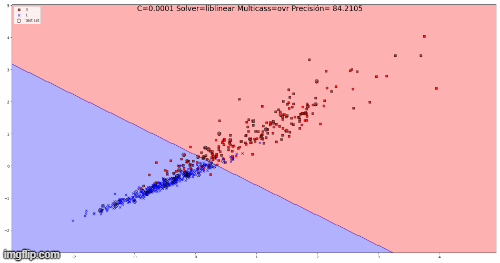
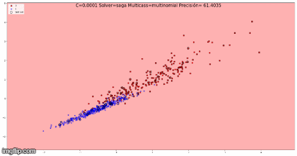

# Tarea 1  **[DeadLine: 1 dic 2020]**
*Nicolás Carrillo Sepulveda - Ingenieria Civil Telematica*
  
## Regresion Logistica Multiple
 

### La regresion losgistica multiple es una generalización de la regresion logistica ya estudiada. En esta su variable dependiente no esta restringida a solo dos categorias. 

### Por ejemplo, un estudio de cine necesita saber cual de sus peliculas sera la mas vista. Para esto usa una regresion logistica multiple o multinomial para determinar si la edad, el genero y las relaciones de pareja de cada persona sobre la pelicula que les gusta.
### Con este ejemplo se puede observar que la "salida" en el proceso de regresion logistica multiple tendra mas de dos, y estara "alimentado" por distinto tipos de parametros ###

  

## 2. Identificar otra base de datos mas grande que iris y correr LR para CLASIFICAR utilizando:

 

 ### La base de datos utilizada es acerca de cancer de mama. Este posee datos de tumores, que tienen diez caracteristicas para cada tumor. En este caso se utilizo el radio promedio y el peor radio.  ###
 
  

### **Graficos Lbfgs-Multinomial**

[1]: gif/lbfgs-multinomial.gif
[2]: img2/lr_lbfgs_multinomial.png
![][1] ![][2]

 

### **Graficos Lbfgs-Multinomial**
 

[1]: gif/lbfgs-ovr.gif
[2]: img2/lr_lbfgs_ovr.png
![][1] ![][2]

### **Tabla NewtonCg-Multinomial**
 

[1]: gif/newton_Multinomial.gif
[2]: img2/lr_newton_multinomial.png
![][1] ![][2]

#### *figura: Animación de regresion logistica con solver "Newton-cg" y multiclass "multinomial".*

   

### **Tabla NewtonCg-Ovr** 
 

[1]: gif/newton_ovr.gif
[2]: img2/lr_newton_ovr.png
![][1] ![][2]

#### *figura: Animación de regresion logistica con solver "Newton-cg" y multiclass "Ovr".*

*AGREGAR COMENTARIOS* *
  

### **Tabla liblinear-Ovr** 
 

#### *figura: Animación de regresion logistica con solver "liblinear" y multiclass "ovr" donde C varia de 1 a 500.*

*AGREGAR COMENTARIOS* *
  

### **Tabla Sag-Multinomial**
 

#### *figura: Animación de regresion logistica con solver "Sag" y multiclass "Multinomial" donde C varia de 1 a 500.*

*AGREGAR COMENTARIOS* *
  

### **Grafico Sag-Ovr**
 

#### *figura: Animación de regresion logistica con solver "sag" y multiclass "ovr" donde C varia de 1 a 500.*

*AGREGAR COMENTARIOS* *
  

### **Grafico Saga-Multinomial**
 

#### *figura: Animación de regresion logistica con solver "Saga" y multiclass "Multinomial" donde C varia de 1 a 500.*

*AGREGAR COMENTARIOS* *
  

### **Grafico Saga-Ovr**
 

#### *figura: Animación de regresion logistica con solver "Sag" y multiclass "Multinomial".*

 ### Comentarios:

 - Para poder observar la la precisión en el grafico animado. se genero un arreglo con diversos vaolres de C entre 0 a 1, y al final valores entre 1 y 5000.

 - Se puede observar que la precisión nunca llega a un 100% en ningun caso. Porque el metodo de regresión logica no llega nunca a separar todos los "puntos" en la grafica.

 - Si bien ninguna combinación llega a converger. Los resultados muestran que separa relativamente bien los dos grupos de tumores (Malgino y Benigno)

  

## Overfitting?
- En ninguno de los casos analizados se ve presencia de ovefitting en ninguno de los casos. Pero se podria plantear que al ser un metodo lineal existiria undefitting. (aunque los porcentajes son bastante altos en algunos casos)