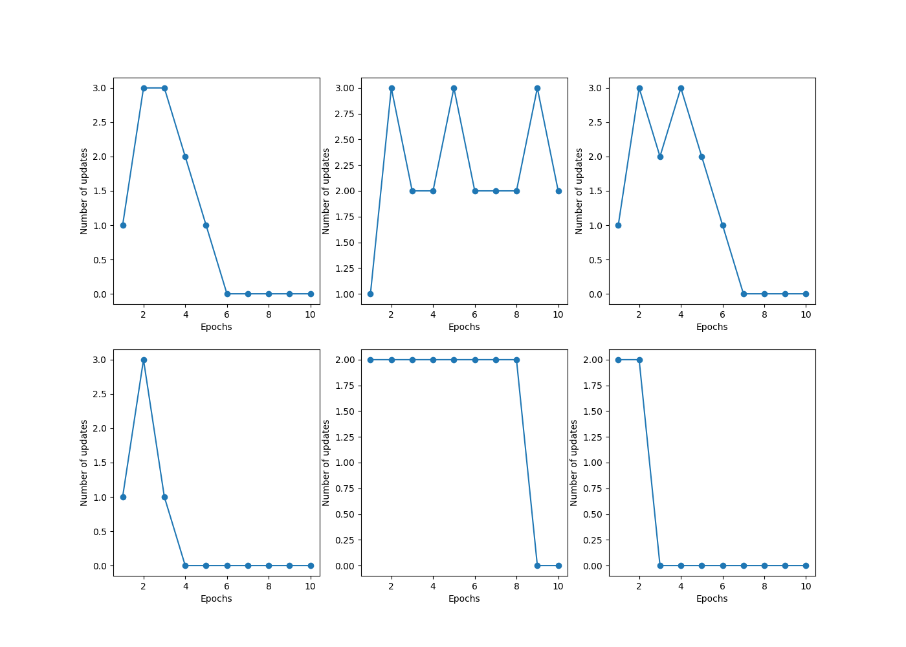

# Tarea para martes 10 de octubre 2020

Con el codigo del libro: Raschka, S.; Mirjalili, V. (2019). Python Machine Learning (Third Edition), Packt Publishing
Capitúlo 2 , pagina 27

#### 0) ¿Qué significa el ploteo de los errores?
1) Graficar otros pares de caracteristicas para buscar los pares que sean separables

    ¿Cuantas son linealmente separables?
    Según el gráfico todos son linealmente separables menos el segundo que es sepal width vs sepal length...
2) Correr "perceptron" con otros pares de caracteristicas (utilizar uno no separable)
segundo grafico no separable

3) Repetir 1) y 2) con otro par de flores

